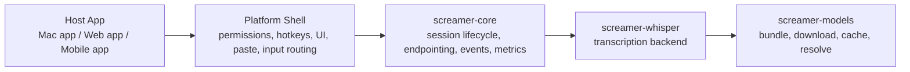

# SDK Refactor Plan

## Goal

Refactor Screamer from a macOS-first application into a reusable voice runtime that:

- powers the existing Mac app
- ships with a managed model experience so developers do not wire up Whisper manually
- can be embedded into future web, mobile, and desktop applications

The architectural goal is:

```text
host app owns UX and platform integration
Screamer owns voice runtime and model provisioning
```

## Product Contract

For developers, the Screamer SDK should feel like one thing:

- install Screamer
- initialize Screamer
- start a push-to-talk or streaming session
- receive partial and final transcript events

Developers should not need to:

- manually integrate Whisper
- manually locate model files
- manually build their own endpointing or live-preview logic

The SDK package must include both:

- the Screamer runtime/core
- a working model provisioning path

On desktop that can mean bundling a default model directly. On web and mobile that can mean first-run download plus caching. The important contract is that Screamer owns model management.

## Non-Goals

This refactor does not aim to:

- redesign the current macOS UI
- solve every platform binding in the first pass
- lock us into one inference backend forever

The first milestone is a clean core/shell split that keeps the current Mac app working while giving us a stable foundation for a web SDK.

## Current State

Today, the repository is app-first:

- [`src/main.rs`](../src/main.rs) boots AppKit and the application event loop.
- [`src/app.rs`](../src/app.rs) owns model loading, session lifecycle, speech trimming, live partial cadence, overlay updates, permissions, and paste dispatch.
- [`src/transcriber.rs`](../src/transcriber.rs) is already the strongest reusable nucleus.
- [`src/recorder.rs`](../src/recorder.rs) is useful, but it assumes Screamer owns microphone capture.
- [`src/model_paths.rs`](../src/model_paths.rs) assumes local bundle or repo-relative models.
- [`src/hotkey.rs`](../src/hotkey.rs), [`src/overlay.rs`](../src/overlay.rs), [`src/paster.rs`](../src/paster.rs), and [`src/permissions.rs`](../src/permissions.rs) are platform-shell concerns.

The biggest blocker to an SDK is that voice-runtime logic still lives inside [`src/app.rs`](../src/app.rs) instead of behind a library boundary.

## Target Architecture



### Layer Responsibilities

#### `screamer-core`

Platform-neutral voice runtime.

Responsibilities:

- session state machine
- audio ingestion API
- speech activity detection and endpointing
- live partial scheduling
- final transcript flow
- transcript formatting and truncation rules
- event emission
- metrics and profiling hooks

Must not depend on:

- AppKit
- CoreGraphics
- clipboard APIs
- global hotkeys
- direct filesystem bundle layout assumptions
- a specific inference implementation

#### `screamer-whisper`

Inference backend built around Whisper.

Responsibilities:

- load and warm model runtime
- own fast and conservative decode paths
- manage final/live inference states
- expose a backend trait implementation to `screamer-core`

This crate should contain most of what is now in [`src/transcriber.rs`](../src/transcriber.rs).

#### `screamer-models`

Model resolution and provisioning layer.

Responsibilities:

- resolve bundled models
- resolve cached models
- download default models when needed
- verify checksum and version
- expose model metadata and selection helpers

This replaces the app-specific assumptions in [`src/model_paths.rs`](../src/model_paths.rs).

#### `screamer-audio-cpal`

Optional native audio capture adapter.

Responsibilities:

- microphone capture via `cpal`
- sample normalization and resampling
- optional waveform snapshots for UI

This crate is useful for the Mac app and native desktop examples, but it should not be required by the core runtime. Hosts must be able to push their own PCM frames.

#### `screamer-macos-app`

The current application becomes a host shell.

Responsibilities:

- menu bar app
- settings and permission windows
- overlay UI
- macOS hotkey handling
- microphone permission prompt flow
- clipboard/paste integration
- calling into `screamer-core`

The Mac app should become a client of the SDK, not the place where the SDK logic lives.

## Proposed Workspace Layout

```text
screamer/
  Cargo.toml                     # workspace root
  crates/
    screamer-core/
    screamer-whisper/
    screamer-models/
    screamer-audio-cpal/
  apps/
    screamer-macos/
  packages/
    screamer-web/               # later
```

## Core API Shape

The key design rule is host-owned audio, Screamer-owned voice logic.

### Rust-facing API sketch

```rust
let runtime = ScreamerRuntime::new(runtime_config, backend, model_provider)?;
let mut session = runtime.start_session(SessionConfig::push_to_talk());

session.push_audio(samples_48khz_mono_or_stereo)?;

while let Some(event) = session.try_next_event() {
    match event {
        ScreamerEvent::PartialTranscript(text) => {}
        ScreamerEvent::FinalTranscript(result) => {}
        ScreamerEvent::Waveform(levels) => {}
        ScreamerEvent::Error(err) => {}
    }
}

let final_result = session.finish()?;
```

### Important properties

- The host may push audio from any source.
- The host may choose push-to-talk or continuous mode.
- The host receives events and decides what to do with them.
- The core never assumes that the final action is paste.

## Backend Interfaces

The core should not know about Whisper directly. It should depend on a narrow backend contract.

Suggested interfaces:

- `SpeechBackend`
- `SpeechBackendSession`
- `ModelProvider`
- `ResolvedModel`

Example responsibilities:

- `SpeechBackend` loads a model and performs transcription
- `ModelProvider` resolves a bundled, cached, or downloaded model
- `ResolvedModel` gives the backend a concrete local artifact to load

This is what keeps the web path open. The web implementation can match the same contract while using a browser-friendly backend and delivery strategy.

## Model Packaging Strategy

The SDK must always present one developer-facing package, but model delivery can vary by platform.

### Desktop

Default approach:

- ship Screamer core
- bundle a default model
- optionally allow larger models to be downloaded later

This gives the best out-of-box developer experience.

### Mobile

Default approach:

- ship Screamer core
- keep the default install size small
- download the default model on first run or first voice use
- cache locally

### Web

Default approach:

- ship a JavaScript package with the same Screamer session contract
- lazy-download model assets into browser-managed storage
- use worker-based execution so the host app is not responsible for inference plumbing

The packaging promise remains the same: developers integrate Screamer, and Screamer handles model availability.

## File Migration Map

### Move into `screamer-core`

- sample rate and resampling helpers from [`src/audio.rs`](../src/audio.rs)
- speech detection and trimming logic currently in [`src/app.rs`](../src/app.rs)
- live partial cadence and session orchestration currently in [`src/app.rs`](../src/app.rs)
- transcript formatting logic currently in [`src/app.rs`](../src/app.rs)

### Move into `screamer-whisper`

- model loading and warm-up from [`src/transcriber.rs`](../src/transcriber.rs)
- final/live inference state reuse
- conservative retry logic
- machine tuning from [`src/hardware.rs`](../src/hardware.rs)

### Move into `screamer-models`

- model lookup rules from [`src/model_paths.rs`](../src/model_paths.rs)
- bundled model metadata now implied by repo scripts and release flow
- future checksum and version manifest support

### Move into `screamer-audio-cpal`

- microphone capture in [`src/recorder.rs`](../src/recorder.rs)
- waveform snapshot support

### Keep in `screamer-macos-app`

- [`src/main.rs`](../src/main.rs)
- [`src/hotkey.rs`](../src/hotkey.rs)
- [`src/overlay.rs`](../src/overlay.rs)
- [`src/loading.rs`](../src/loading.rs)
- [`src/settings_window.rs`](../src/settings_window.rs)
- [`src/permission_window.rs`](../src/permission_window.rs)
- [`src/permissions.rs`](../src/permissions.rs)
- [`src/paster.rs`](../src/paster.rs)
- [`src/sound.rs`](../src/sound.rs)
- [`src/theme.rs`](../src/theme.rs)

## Execution Plan

### Phase 0: Preserve Current Behavior

- add tests around endpointing, short-utterance salvage, transcript formatting, and model selection
- keep the existing latency benches working as regression checks
- document the current app-path flow so we can compare before and after

### Phase 1: Create Library Boundaries

- turn the repo into a workspace
- create `screamer-core`, `screamer-whisper`, and `screamer-models`
- keep the existing app building while moving code with minimal behavior changes

Exit criteria:

- Mac app still works
- transcriber loads through crate boundaries instead of app-local modules

### Phase 2: Extract Session Runtime

- move recording-session orchestration out of [`src/app.rs`](../src/app.rs)
- move live preview cadence, endpointing, trimming, and finalization into `screamer-core`
- replace direct paste assumptions with emitted events

Exit criteria:

- Mac app uses event callbacks from `screamer-core`
- no speech-runtime logic remains in the AppKit shell

### Phase 3: Extract Model Provisioning

- replace repo-relative model lookup with a `ModelProvider`
- define bundled vs cached vs downloaded model resolution
- keep desktop bundling compatible with the current release flow

Exit criteria:

- Mac app gets a resolved model through `screamer-models`
- model management is no longer coupled to bundle path layout

### Phase 4: Convert Mac App into a Shell

- keep Mac-specific UX in the app crate only
- wire hotkey press/release into `screamer-core`
- wire final transcript into paste only at the shell layer

Exit criteria:

- the Mac app is a Screamer host, not the implementation of Screamer itself

### Phase 5: Prepare Web SDK

- define a JS-friendly event contract mirroring `screamer-core`
- prototype a browser host that pushes audio chunks into the same session model
- reuse the model provisioning contract with browser-specific storage and delivery

Exit criteria:

- web work happens against a stable runtime contract, not a Mac-specific code path

## Risks

### Risk: Overfitting to the current push-to-talk Mac flow

Mitigation:

- keep the core API framed around sessions and events, not hotkeys and paste

### Risk: Shipping one SDK but many packaging behaviors

Mitigation:

- keep one developer contract
- allow platform-specific model delivery under the hood

### Risk: Web support gets blocked by native assumptions

Mitigation:

- keep `screamer-core` free of native UI, native audio capture, and filesystem bundle assumptions
- keep Whisper behind a backend contract

## First Refactor Slice

The first concrete implementation slice should be:

1. Create a workspace and `screamer-core` crate.
2. Move speech detection, trimming, live transcript formatting, and session orchestration out of [`src/app.rs`](../src/app.rs).
3. Keep the Mac app calling that new core through an internal crate dependency.
4. Leave AppKit, hotkeys, permissions, and paste behavior unchanged for now.

This is the smallest slice that creates a real SDK boundary without trying to solve every platform in one move.

## Success Criteria

We should consider the refactor on track when all of the following are true:

- the Mac app depends on a reusable Screamer core crate
- the core crate can run without AppKit
- the model is resolved through a dedicated model layer
- audio can be pushed in by a host instead of always captured internally
- final output is exposed as events instead of hardcoded paste behavior
- the web version can target the same session and model contracts
